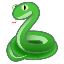

#
**<H1 align = "center">Snake Game </H1>**

## Description


**Author** : Susovan Das

**Language** : Python

**Version** : 1.0

This is a classic game of Snake. This game written in _Python_ language and i use the _PyGame_ Module to create this.

## How to Download

To download this game Click this --> &nbsp; &nbsp; [][DownGit]

## Requirements

This game is created by using an external module named _pygame version(2.0.1)_.

So use the package manager [pip](https://pypi.org/project/pip/) to install those package.

```bash
pip install pygame==2.0.1
```

## Usage

You can run this by simply double clicking the _snake_game.py_ files.  
Or you can use the Command Prompt/Terminal and `python snake_game.py`.  

**Controls**  
* Use _Up Arrow_ key to go upwards.  
* Use _Down Arrow_ key to go downwards.  
* Use _Left Arrow_ key to go Left.  
* Use _Right Arrow_ key to go right.  
* To Mute the background music press _m_.  
* To Pause the game press _Space Bar_.

<!--Inner Links-->
[DownGit]: https://minhaskamal.github.io/DownGit/#/home?url=https://github.com/SusovanGithub/Python-Games/Snake_Game